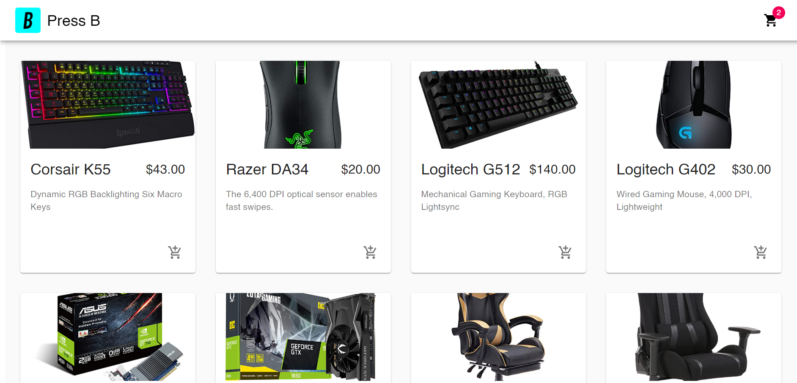

# Press B (A E-commerce Website)

Press B is a ecommerce website made with ReactJS, CommerceJS API , MaterialUI & Stripe.

## Have a look

The website is currently hosted on Netlify , [Take a look :)](https://pressb.netlify.app/)

## Credits
The design and idea all belongs to [JavaScript Mastery](https://www.youtube.com/channel/UCmXmlB4-HJytD7wek0Uo97A) on YouTube, This web App was created by following his video titled ["ECommerce Web Shop - Build & Deploy an Amazing App | React.js, Commerce.js, Stripe"](https://www.youtube.com/watch?v=377AQ0y6LPA).

## What did i learn
I had no prior understanding of react when I started the project, and while it has shown me the gist of why people are so enthusiastic about it, I still have a lot to learn about it. As this was my first experience with a medium-sized development, I followed JSM to some extent, but because the video  , packages and dependencies that the site was built on were over a year old, I had to figure out how to work around some errors, and as a result, I now understand how important error handling and management are.
I had a lot of fun working on this project, and despite the fact that it took me a month to complete, I would like to add extra features and make updates to the basic looking UI.

## Contributing
Pull requests are welcome. For major changes, please open an issue first to discuss what you would like to change.

Please make sure to update tests as appropriate.
